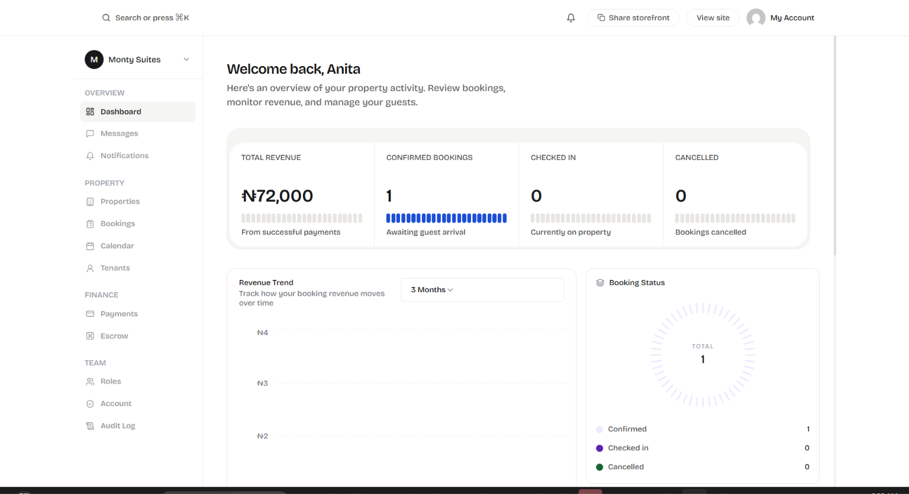
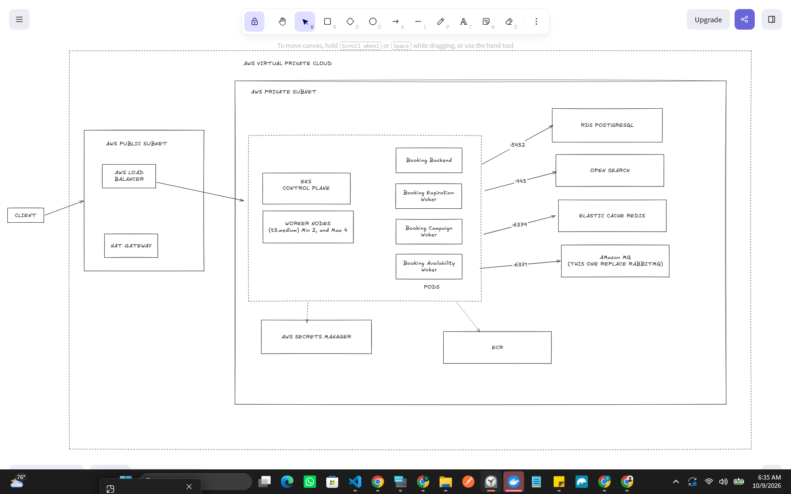

# Bukking

Taking short-stay bookings online is messy: rooms get double-booked, payments are hard to track, one bad actor can hammer the whole platform, and you can’t always kick a stolen session offline. Most hosts end up using several tools together. Bukking is built so those pieces work as one system.

**Bukking** is a multi-tenant booking marketplace for shortlets, hotels, and guesthouses.

**Live:** [https://bukkings.space](https://bukkings.space)  
**Stack:** Node.js, TypeScript, PostgreSQL, Redis, RabbitMQ, Docker Compose

---

## Try it

1. Open the [live demo](https://bukkings.space).
2. Browse as a guest, or create a host account (email OTP).
3. Host path: onboarding → properties → bookings and payouts in the dashboard.

Local: API `4000` · gateway `8080` · frontend `5173`.


---

## Hard problems this system is built around

These are the few parts the system actually depends on and not just a feature list.

### 1. Idempotency

Payment init, webhooks, and other side-effecting writes must not double-apply when the client retries or the gateway delivers twice. Idempotency keys and state transitions are part of the money and booking paths so “submit again” does not create a second charge or a second booking transition.

### 2. Transactional outbox

Domain commits and “tell the rest of the system” are not two independent hopes. Events are written in the same database transaction as the business row, then published asynchronously (outbox poller / workers). That keeps booking confirmed, notifications, audit, and downstream consumers aligned when the process crashes mid-request.

### 3. Tenant-aware rate limiting

Abuse is not only global. Limits are matched by identity (user vs IP), route, and tenant/user type at the gateway, with Redis-backed limiters and fail-closed behavior on sensitive auth routes when Redis is down. One noisy tenant or scraper should not define the experience for everyone.
    
### 4. Reclaim / recovery workflows

Holds expire, unpaid `pending_payment` bookings time out, availability locks are swept, and reconciliation passes close gaps the happy path missed. The system assumes partial failure: reclaim is a first-class workflow, not a manual SQL cleanup.

### 5. Session-based auth (revocable)

Access is not “JWT until expiry only.” Login creates a durable session (device metadata, lifecycle in Postgres) with a hot-path version/revocation check (Redis). Logout, logout-all, admin revoke, and password change invalidate sessions without waiting for token TTL. Idle and multi-device behavior are part of the model.

### 6. Double-entry ledger

Money movement is recorded as real debit/credit entries (payment received, escrow hold/release, refund, chargeback paths), not only a status flag on a payment row. Balances and clawback/refund decisions can be reasoned about from the ledger, scoped correctly (e.g. per booking, not an unrelated aggregate).


### 7. Observability you can operate

The system is instrumented to answer “is it broken?” and “where?” without SSHing into a box first.

- **Metrics (Prometheus):** HTTP RED, domain ops (`measureAuthOp`, `measureBookingOp`, `measurePaymentOp`, …), DB query timing, cache hit/miss, worker job success/duration. Low-cardinality labels only (operation, status, route — not user or booking IDs).
- **Workers expose `/metrics`** on their own ports so background reclaim, import, and outbox work is visible, not only the API.
- **Grafana:** overview (RED), critical domains, workers, database pool/query latency, and deeper KPI boards (confirm success rate, auth funnel, payment path).
- **Telegram alerts:** health down, elevated 5xx, auth/payment error rates, worker job failures, DB pool saturation — to a phone, not only a dashboard tab.
- **k6 SLIs:** critical paths (health, authenticated reads, booking list) and hot paths (public search/list), with thresholds that match the same availability and latency budgets the alerts use.

If it cannot be measured or paged, it is not fully “in production” for this codebase.

### 8. Tests as a product constraint

Unit tests target repositories and services (infra mocked). Integration tests spin real Postgres via Testcontainers, apply the real migration set, and exercise HTTP routing end to end. The intent is to lock the money path, session revoke, and outbox seams — not only utility helpers. Coverage is still partial; suites do not yet run as `booking_app`, so RLS is not asserted in CI. That gap is tracked, not ignored.


---

## What sits on top of that spine

Availability calendars and locks, escrow release to hosts, RBAC, subdomain storefronts (`sellername.bukkings.space`), CSV import, host notifications, and audit trails all depend on the six problems above. Custom apex domains are designed (Caddy + TLS); not live on the current host edge.

**Multi-tenant data plane:** `FORCE ROW LEVEL SECURITY` + `SET LOCAL app.current_tenant_id` under PgBouncer transaction pooling. Policies exist; runtime still uses `postgres` via PgBouncer in places, so RLS is **not** end-to-end enforced yet. Intended roles: `booking_app` (RLS) and `booking_worker` (`BYPASSRLS`).

---

## Shape of the system


| Process              | Role                                                                                                                            |
| -------------------- | ------------------------------------------------------------------------------------------------------------------------------- |
| **backend** `:4000`  | API + in-process workers (availability sweep, booking expiry/reclaim, import, notifications, campaigns, audit/outbox consumers) |
| **gateway** `:8080`  | Rate limiting, subdomain → tenant                                                                                               |
| **frontend** `:5173` | Guest marketplace + host dashboard                                                                                              |

Workers are **in-process** for Railway cost limits; separate-container layout remains on `archive/separate-worker-containers`. Search runs in Postgres (`tsvector`, `pg_trgm`, `earthdistance`) after dropping Elasticsearch.

---

## Tradeoffs

| Choice                                     | Why                                 | Cost                                                     |
| ------------------------------------------ | ----------------------------------- | -------------------------------------------------------- |
| Outbox over sync dual-write                | Crash-safe side effects             | Poller lag; at-least-once consumers must be idempotent   |
| Session version in Redis + row in Postgres | Fast revoke + queryable device list | Two stores to keep coherent on revoke                    |
| Tenant/route rate limits at gateway        | Fairness and auth abuse control     | Redis dependency; fail-closed on auth when Redis is down |
| Ledger + escrow statuses                   | Auditable money                     | More write path complexity than a single status enum     |
| In-process workers                         | One deploy unit on a budget         | Shared blast radius with API                             |
| Boot idempotent SQL migrations             | Fast solo iteration                 | No version table / downs yet                             |

---

## Run locally

```bash
npm install
npm run docker:up:build
```

Windows (Puppeteer): `PUPPETEER_SKIP_DOWNLOAD=true npm install`.

```bash
npm run test
npm run test:integration
```

Integration uses Testcontainers Postgres and real migrations. Suites do not yet assert RLS under `booking_app`. Coverage is partial; money path, outbox, and session revoke are the priority seams.

---

## Docs

|               |                        |
| ------------- | ---------------------- |
| API contracts | `docs/api-contracts/`  |
| ADRs          | `docs/ADR-*.md`        |
| Runbooks      | `docs/runbooks/`       |
| Workers       | `packages/*/README.md` |

---

## Not claimed

- RLS enforced on every production connection
- Perfect once-only delivery without consumer idempotency
- Complete automated coverage of every domain
- Alerting with zero false positives  